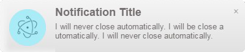

## Electron Notifications

A node module for sending desktop notification in electron applications.

## Quick Usage

~~~ javascript
const notifier = require('electron-notfier-desktop')

// Just title
notifier.notify('Notification Title')

// Full Options
notifier.notify('Notification Title', {
  message: 'This is the content of the notification. This is the content of the notification. This is the content of the notification.',
})
~~~

## Installation

~~~
npm install --save electron-notification-desktop
~~~

## Introduction

When you create a new notification, your notification is queued, since we only
display one at a time. Each notification is a [BrowserWindow](browserwindow)
instance, so it's completely cross platform.

## Options

All options are optional.

* `message`: A message to display under the title.
* `icon`: The absolute URL of a icon displayed to the left of the text ,image size 85px* 85px.
* `duration`: A notification is closed after 4.5s by default. When specifying duration to null or 0, it will never be closed automatically.

## Duration after which the notification  is closed

~~~ javascript
const notification = notifier.notify('Notification Title',{
  message:'I will never close automatically. I will be close automatically. I will never close automatically.',
   duration: 0,
  })
~~~
## Events

In addition to the [events provided by electron](events) you also have access to
the following additional events.

### Clicked

When the notification was clicked, but not dragged. This usually does the
default action, or closes the notification.

~~~ javascript
const notification = notifier.notify('Notification Title',{
  message:'This is the content of the notification. This is the content of the notification. This is the content of the notification.'
  })

notification.on('clicked', () => {
  notification.close()
})
~~~

[events]: https://github.com/electron/electron/blob/master/docs/api/browser-window.md#events
[browserwindow]: https://github.com/electron/electron/blob/master/docs/api/browser-window.md
